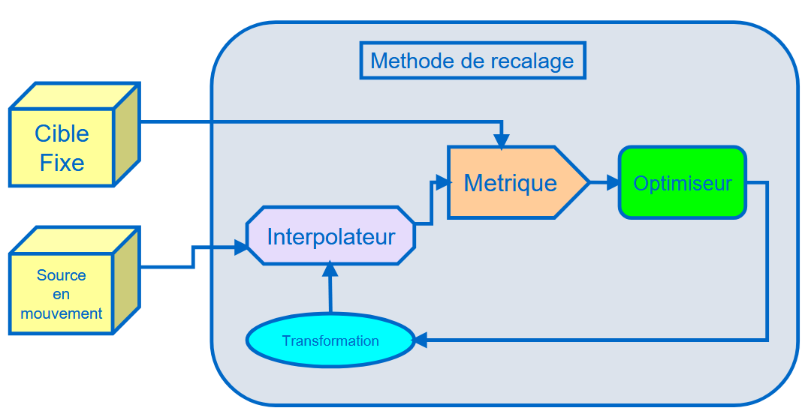
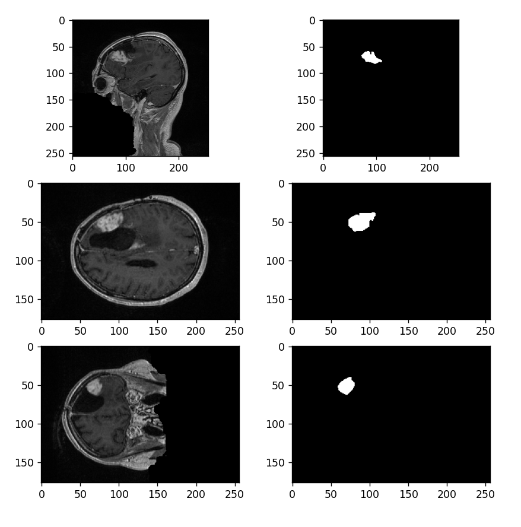
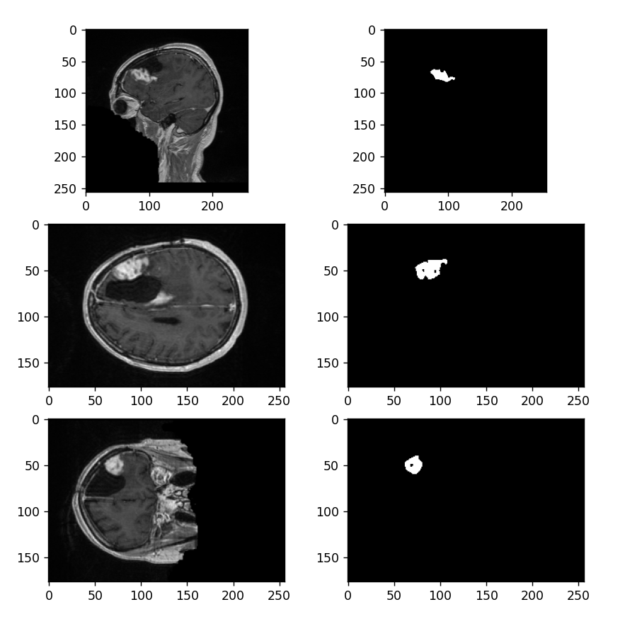

# Etude longitudinale de l’évolution d’une tumeur
Ce projet a pour objectif de réaliser le suivi des changements d'une tumeur à partir de deux scans effectués sur un même patient à des dates différentes.

## Execution du code
 1. Clonez le dépôt et placez-vous dans la racine du projet.

 2. Installez les dépendances nécessaires :
```sh
pip install -r requirement.txt
```

 3. Exécutez le script principal :
```sh
python main.py
```

## Répartition du travail
Antoine HAVARD : ...

Emma CASAGRANDE : ...

Salomé BERGER : ...

Corentin COLMEL : ...

## Recalage d'images
**A compléter**, utiliser la lib itk
 - Méthode utilisée
 - Pourquoi cette méthodes
 - Les Difficultés rencontrées
 - Le résultat

Pour recalé **l'image 2** sur **l'image 1**, on à suivi cette pipeline de traitement :


### Algorithme pour la métrique
 - **MeanSquaresImageToImageMetricv4** : Calcule la moyenne des carrés des différences d’intensité entre les deux images. Plus la différence est faible, plus l’alignement est bon.

 - **CorrelationImageToImageMetricv4** : Calcule la corrélation linéaire entre les intensités des deux images.

**MeanSquaresImageToImageMetricv4** est bien adaptée car les deux images IRM ont une intensité comparable voxel par voxel. Elle donne des résultats rapides et stables dans ce contexte homogène.


### Algorithme pour l'optimiseur
 - **RegularStepGradientDescentOptimizerv4** : Descente de gradient avec un pas régulier qui diminue progressivement.

 - **GradientDescentOptimizerv4** : Descente de gradient classique avec un pas fixe.

 - **AmoebaOptimizerv4** : Méthode de Nelder-Mead, sans utiliser de dérivées.

**RegularStepGradientDescentOptimizerv4**  converge bien et est plus tolérant au bruit. D’autres méthodes comme Amoeba ou GradientDescent étaient soit trop sensibles aux paramètres initiaux, soit plus lentes à converger.


### Algorithme pour la transformation

Pour la transformation, nous avons regarder 2 grand cas :

#### Test n°1: VersorRigid3DTransform

Pour commencer, on a voulu tester de faire un recalage en appliquant une translation et une rotation. Pour cela on a utilisé VersorRigid3DTransform
qui fonctionnait bien avec des images médicales en 3D.

**Description:** VersorRigid3DTransform applique une rotation et une translation à l'espace.

**Analyse:**

- __Image Gauche__: Fixed Image
- __Image Milieu__: Moving Image
- __Image Droite__: Résultat

<video src="bin/test1_comp.mp4" controls></video>

__Paramètres finaux de transformation :__
- Angle de rotation (radians) : -0.00463
- Translation (x, y, z) : (-0.01, 0.00, -1.84)
- Nombre d'itérations :  20
- Valeur finale de la métrique :  28735.10959828842


Nous pouvons constater que le résultat est assez mauvais, probablement en raison de l'inclusion d'une transformation de rotation.

#### Test n°2: TranslationTransform

Au lieu de cela, nous avons opté pour l'application d'une translation.

**Description:** Translation d'un espace de coordonnées 2D ou 3D.

**Analyse:**

<video src="bin/translation_test1.mp4" controls></video>

- optimizer.SetLearningRate(4.0)
- optimizer.SetMinimumStepLength(0.001)
- optimizer.SetNumberOfIterations(500)

__Paramètres finaux de transformation :__
Translation (x, y, z) : (-0.83, -3.54, -59.46)
Nombre d'itérations :  20
Valeur finale de la métrique :  11180.776647271514

On peut voir que le résultat final est beaucoup meilleur, également indiqué par la valeur finale de l'optimizer qui a été coupé en deux.

Néanmois, on a testé de changer les paramètres de l'optimizer pour voir si on pouvait encore amellioré le score:

**TEST 1:** augmenter iterations
- optimizer.SetLearningRate(4.0)
- optimizer.SetMinimumStepLength(0.00001)
- optimizer.SetNumberOfIterations(500)

__Paramètres finaux de transformation :__
Translation (x, y, z) : (-0.83, -3.54, -59.46)
Nombre d'itérations :  32
Valeur finale de la métrique :  11180.21821197873


**TEST 2:** Réduire le learning rate
- optimizer.SetLearningRate(1.0)
- optimizer.SetMinimumStepLength(0.00001)
- optimizer.SetNumberOfIterations(200)

__Paramètres finaux de transformation :__
Translation (x, y, z) : (-0.83, -3.54, -59.46)
Nombre d'itérations :  27
Valeur finale de la métrique :  11180.221791522592

Ces changements n'apportent que une très petit réduction du score.

### récapitulatif des fonction utilisé

| Méthode            | Algorithme                              | Utilité                                                                      | Justification du choix                                                                           |
| :----------------: | :-------------------------------------: | :--------------------------------------------------------------------------: | :----------------------------------------------------------------------------------------------: |
| **Transformation** | `TranslationTransform`                  | Modélise un simple décalage en X, Y, Z                                       | Les images proviennent du même patient, sans rotation ni déformation importante              |
| **Optimisation**   | `RegularStepGradientDescentOptimizerv4` | Cherche les meilleurs paramètres de transformation en minimisant la métrique | Méthode simple, stable et efficace pour des problèmes bien posés comme notre cas                       |
| **Métrique**       | `MeanSquaresImageToImageMetricv4`       | Compare directement les intensités voxel à voxel entre les deux images       | Les images étant de même modalité et contraste, la comparaison d’intensité est adaptée et rapide |


## Segmentation des tumeurs
**A compléter**, utiliser la lib itk
 - Méthode utilisée
 - Pourquoi cette méthodes
 - Les Difficultés rencontrées
 - Le résultat

## Segmentation

La segmentation se fait en deux parties :

### 1. Adoucir l'image

Cette étape a pour but de réduire le bruit dans la tumeur et de flouter la forme de la tumeur pour éviter les imprécisions.

Nous avons utilisé la fonction [`itk.CurvatureFlowImageFilter`](https://docs.itk.org/projects/doxygen/en/stable/classitk_1_1CurvatureFlowImageFilter.html).

---

### 2. Seuillage connecté

Ce seuillage commence à une position choisie et vérifie pour chaque voisin s'il est entre les seuils inférieur et supérieur.  
L'algorithme se propage ainsi et marque toutes les positions par lesquelles il passe.

À partir de nos observations, nous avons décidé d'utiliser :

- La position de départ : `(90, 70, 51)`
- Les seuils : `500` (inférieur) et `800` (supérieur)

La fonction utilisée pour cet algorithme est [`itk.ConnectedThresholdImageFilter`](https://simpleitk.org/doxygen/latest/html/classitk_1_1simple_1_1ConnectedThresholdImageFilter.html).

---

Avec cet algorithme, nous avons délimité la zone de la tumeur. Voici les résultats :

#### Résultat pour l'image 1 :



#### Résultat pour l'image 2 (recalée) :



## Analyse et visualisation
**A compléter**, utiliser la lib vtk
 - Methodes de calcul des différences de volume, forme, position entre 2 tumeurs
 - Méthode de visualisation
 - Guide et fonctionnement
